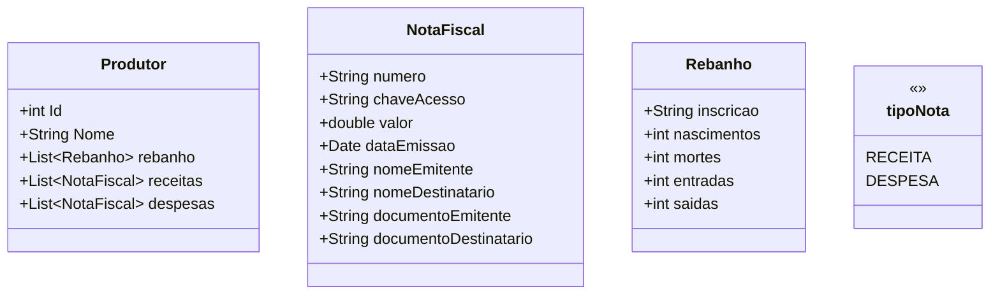
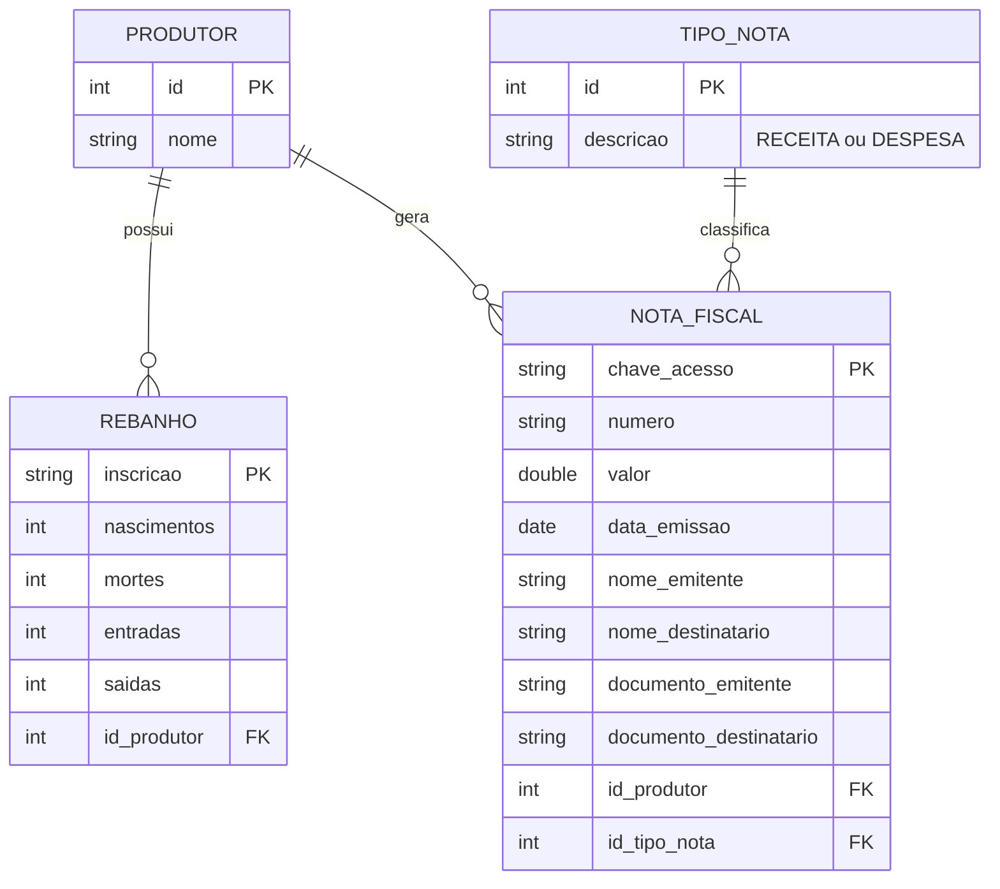

# Sistema de Gestão Fiscal e Rebanho Rural

Software desktop para produtores rurais, focado no controle de:
- Notas fiscais (entradas e saídas)
- Receitas e despesas
- Controle de rebanho por inscrição estadual
- Relatórios mensais e anuais
- Integração automatizada com SEFAZ-MS e DF-e

---

## 🎯 Objetivo

Centralizar a gestão fiscal e zootécnica do produtor rural em um sistema:
- Offline-first
- Seguro
- Auditável
- Compatível com obrigações fiscais brasileiras

---

## 🧱 Arquitetura

- Plataforma: **.NET 8**
- Tipo: **Desktop**
- Banco de dados: **SQLite embutido**
- ORM: **Entity Framework Core**
- Automação:
  - Playwright (.NET)
  - Webservice DF-e (oficial)
- Relatórios: PDF / Excel

Arquitetura em camadas:
UI → Application → Domain → Infrastructure → SQLite

---

## 🐄 Funcionalidades

### Rebanhos
- Cadastro manual de rebanhos
- Controle de entradas, saídas, nascimentos e mortes
- Saldo automático

### Fiscal / Financeiro
- Cadastro manual de notas fiscais
- Receitas e despesas
- Relatórios mensais e anuais
- Exportação de dados

### Automação Fiscal
- Coleta de chaves de acesso via SEFAZ-MS
- Integração oficial DF-e
- Download e armazenamento de XML
- Consulta por NSU

---

## 🔐 Segurança

- Certificado digital A1 ou A3
- Banco local criptografado
- Backup automático
- Logs fiscais

---

## 📦 Banco de Dados

- SQLite local
- Offline-first
- Estrutura versionada
- Backup manual e automático

---
## 🧱 Diagrama de Classes

## ↔️ Diagrama ER

## 🚀 Status do Projeto

🟡 Em desenvolvimento  
🔜 Primeira versão funcional prevista após Sprint 3

---

## 📄 Licença

Projeto de uso restrito e privado.
